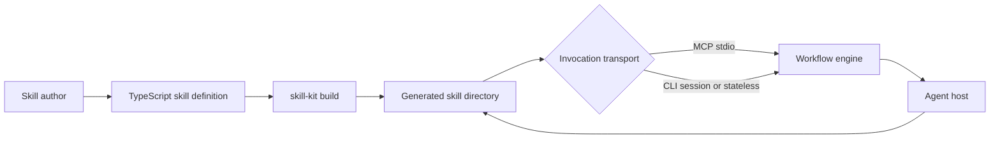

# Architecture

## Overview

`@contentful/skill-kit` is a TypeScript SDK for defining portable agent skills as typed workflows. Authors declare steps, schemas, transitions, actions, references, and host-aware prompt primitives; the build pipeline packages those definitions into agentskills.io-compatible skill directories.

The repository contains a library and build CLI, not a hosted service. Built skills run locally through either an MCP stdio server or a subprocess-oriented CLI protocol.

## System context



The generated package contains `SKILL.md`, `scripts/run`, a Node bundle or platform executables, `package.json`, and copied references. The host reads the generated instructions and invokes the package; the engine owns validation, state, transitions, and deterministic actions.

## Internal structure

| Path                                                            | Responsibility                                                                    |
| --------------------------------------------------------------- | --------------------------------------------------------------------------------- |
| `src/skill.ts`, `src/skill-builder.ts`, `src/types.ts`          | Public workflow builder and type contracts                                        |
| `src/types/`                                                    | Complex store and graph types plus compile-time type tests                        |
| `src/reference.ts`, `src/reference-builder.ts`, `src/module.ts` | Reference skills and reusable workflow composition                                |
| `src/runtime/`                                                  | Workflow execution, append-only state, validation, observers, and prompt assembly |
| `src/validation/`                                               | Static cycle detection and implicit visit-limit analysis                          |
| `src/protocol/`                                                 | CLI, session-file, composite, reference, and MCP transport adapters               |
| `src/primitives/`                                               | Host-aware XML prompt primitives and tool mappings                                |
| `src/render/`                                                   | Deterministic Markdown render helpers                                             |
| `src/build/`                                                    | Bundling, wrappers, generated `SKILL.md`, and package metadata                    |
| `src/lint/`                                                     | Static checks for portable prompt and reference usage                             |
| `src/testing/`                                                  | In-process test runners and mock-model helpers                                    |
| `examples/`                                                     | Workflow, reference, composite, primitive, and game examples                      |
| `docs/`                                                         | Detailed API, implementation architecture, host guidance, and decision records    |
| `docs-site/`                                                    | Astro documentation site; content mirrors repository Markdown manually            |
| `tasks/`                                                        | Public implementation plans and historical design evidence                        |

### Extension patterns

Use the nearest checked-in sibling rather than inventing a new shape. A new host prompt primitive should follow `src/primitives/confirm.ts` and its test, add its public config and builder types in `src/types.ts`, then be wired through `src/primitives/registry.ts`, `src/primitives/index.ts`, and `src/act.ts`. For skill examples, `examples/get-to-know-you/` is the smallest workflow template and `examples/contentful-help/` demonstrates composite and reference behavior.

## Definition and execution flow

1. An author creates a workflow with `skill()` and chained `.step()` calls, or creates a progressive-disclosure reference with `reference()`.
2. The builder records the runtime definition while its generic accumulators derive parameter, response, action-result, branch, and store types.
3. At invocation, the transport constructs a `WorkflowEngine` with validated parameters, host capabilities, and a reference loader.
4. The engine emits the current prompt and optional JSON Schema. Prompt pieces become ordered XML blocks for instructions, system framing, host-aware actions, and deterministic rendered output.
5. The host returns a response. The engine validates it, runs any declared action, applies `save()` writes, appends the result to state, and resolves the next transition.
6. CLI execution and MCP advancement auto-advance through prompt-less steps. Plain and composite MCP `start` calls return the entry step directly; a redirected sub-skill start auto-advances. Terminal transitions return the final output, while composite redirects enter a registered sub-skill or resolve a topic.

The lifecycle implemented by `src/runtime/engine.ts` is:

```text
prompt -> response validation -> action -> save -> append state -> transition
```

## State model

The store separates step results under `store.steps` from named domain sub-stores. Step records are append-only so CLI history replay can rebuild state without re-running side effects. Builder types analyze the declared graph so results on every path are required while branch-only results remain optional.

Cycles are guarded. Explicit `maxVisits` and `onMaxVisits` configure intended loops; graph analysis supplies a bounded safety limit for other detected cycles.

## Transport flow

### MCP

`src/protocol/mcp-entry.ts` creates a stdio MCP server with `start` and `advance` tools. Each MCP session holds a workflow engine in memory and is removed when the workflow completes. Composite and reference definitions use sibling MCP adapters.

### CLI session mode

Session mode stores typed JSONL records in a private temporary directory. The host appends an output record and calls `advance`; the CLI returns the line number containing the next prompt or terminal result. `src/protocol/secure-tmp.ts` and `src/protocol/session.ts` protect these files with restrictive permissions and exclusive creation.

### CLI stateless mode

Stateless invocations pass history on each `advance` call. The engine replays validated records to reconstruct state without repeating actions or observers. This mode is portable but produces larger command payloads than session mode.

## Build and distribution flow

`src/build/index.ts` loads and validates an author definition, selects a build mode, writes a shell wrapper, generates `SKILL.md` and package metadata, and copies references.

- Bun mode compiles platform-specific standalone executables. Its default targets are macOS ARM64 and Linux x64.
- Node mode uses esbuild to produce one minimized ESM bundle targeting Node.js 24.

The checked-in package itself is built with TypeScript and published to the GitHub Packages registry configured in `package.json` and `.npmrc`. Main-branch CI verifies and releases through `.github/workflows/ci-cd.yml`.

## Domain concepts

- **Skill definition** — a named workflow graph with parameters, steps, optional sub-stores, and optional sub-skills or topics.
- **Step** — a prompt/response boundary plus an optional deterministic action, save mapping, and transition.
- **Action** — a side effect executed by the workflow engine after response validation; it is not a model-selected host tool.
- **Store** — append-only step results plus deep-merged named sub-stores.
- **Primitive** — an author-facing intent such as asking a question or presenting a plan, rendered as XML and mapped to an available host tool through the preamble.
- **Reference skill** — a set of lazily loaded topics without workflow state.
- **Composite skill** — a dispatcher workflow that can redirect into isolated sub-skills or reference topics.
- **Build mode** — Bun standalone executables or a Node 24 ESM bundle.
- **Protocol** — MCP, file-backed CLI session, or stateless CLI history.

## Context and evolution

The accepted decision in `docs/ADRs/2026-04-17-use-typed-cli-driven-workflows.md` explains why the project uses typed TypeScript definitions with SDK-owned control flow instead of increasingly complex prose-only skills. Public implementation plans under `tasks/` record how later capabilities were introduced.

Current maintenance tradeoffs are visible in the repository itself: Markdown and Astro MDX documentation must be synchronized manually, stateless invocations grow as their history grows, and every transport must preserve the same engine semantics. These are known constraints, not separate deployed systems.

`catalog-info.yaml` declares this repository as a library and defines no service or API dependencies. Cross-repository consumers depend on the published package or generated skill directories; this repository has no checked-in upstream producer or downstream service contract.

## Key dependencies

| Dependency                 | Role                                                                  |
| -------------------------- | --------------------------------------------------------------------- |
| ArkType                    | Public runtime schemas, response validation, and TypeScript inference |
| Zod                        | MCP SDK input schema integration                                      |
| Model Context Protocol SDK | MCP stdio server and tool registration                                |
| esbuild                    | Node-mode bundling                                                    |
| tsx                        | TypeScript execution during development and CLI bootstrap             |
| TypeScript                 | Declaration and JavaScript build output                               |

The SDK has no runtime database, queue, or network service dependency. Actions authored by downstream skills can introduce their own external effects.

## Configuration

Author-facing workflow behavior is configured through typed builder options and CLI flags. Generated Node `scripts/run` wrappers set the internal `SKILL_DIR` variable so reference files resolve relative to the installed skill. The release workflow retrieves its automation token from Vault and uses the GitHub Actions token for package-registry authentication.

## Operational knowledge

### Verification

Pull requests run type checking, SDK tests, formatting, linting, package builds, example checks, and the documentation build in `.github/workflows/ci.yml`.

### Release

Pushes to `main` run verification and `release-it`. The release workflow publishes the package and creates the matching GitHub release and tag. Release commits are excluded from recursively starting another release.

### Documentation

Changes under the documentation paths trigger an Astro build and GitHub Pages deployment. Markdown and MDX sources are not automatically synchronized, so behavior changes must update both surfaces.

### Failure modes

- Invalid model output returns a retryable validation result instead of advancing the workflow.
- Missing Bun prevents Bun-mode builds; Node-mode builds require Node.js 24 at runtime.
- A terminated MCP process loses in-memory sessions; callers must start a new session.
- Interrupted CLI sessions remain recoverable only while their protected JSONL file exists.
- Documentation can drift when only one of the repository Markdown or Astro MDX copies is updated.
