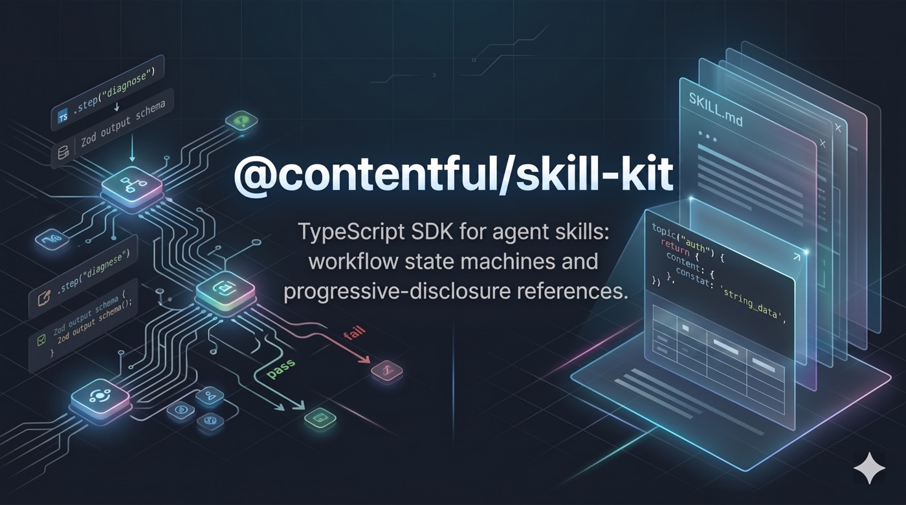

<p align="center">
  
</p>

<p align="center">
  
  
  
</p>

<p align="center">
  <a href="#quick-start">Quick Start</a> · <a href="#skill-types">Skill Types</a> · <a href="#how-it-works">How It Works</a> · <a href="#examples">Examples</a> · <a href="#api">API</a> · <a href="./docs/api.md">Full API Reference</a> · <a href="./docs/architecture.md">Architecture</a> · <a href="./SPEC.md">Spec</a>
</p>

---

A prose skill is a blob of markdown the agent reads all at once. That works until it doesn't — multi-step workflows need branching and validation, and large reference docs need progressive disclosure.

skill-kit gives you two tools. **Workflow skills** are typed state machines — steps with prompts, Zod schemas, and explicit transitions. **Reference skills** are on-demand topic loaders — the agent reads the SKILL.md, then loads detailed content one topic at a time. Both bundle into self-contained packages that agents invoke via Bash.

```typescript
import { skill, z } from '@contentful/skill-kit';

export default skill({
  name: 'repo-doctor',
  entry: 'diagnose',
})
  .step('diagnose', {
    prompt: 'Inspect the repository. Report health checks for CI, linting, and test coverage.',
    output: z.object({
      checks: z.array(
        z.object({
          name: z.string(),
          status: z.enum(['pass', 'fail']),
          detail: z.string(),
        }),
      ),
    }),
    next: ({ output }) => (output.checks.some((c) => c.status === 'fail') ? 'remediate' : 'report'),
  })
  .step('remediate', {
    /* fix failing checks */
  })
  .step('report', {
    /* render results, terminal */
  })
  .build();
```

That's a skill. The agent sees one step at a time, returns structured output, and the CLI decides what happens next.

## Quick Start

```bash
pnpm add @contentful/skill-kit
```

### Define a skill

```typescript
import { skill, z } from '@contentful/skill-kit';

export default skill({
  name: 'greet',
  entry: 'ask',
})
  .step('ask', {
    prompt: 'Ask the user for their name.',
    output: z.object({ name: z.string() }),
    next: 'welcome',
  })
  .step('welcome', {
    prompt: ({ prev }) => `Say hello to ${(prev as { name: string }).name}.`,
    output: z.object({ message: z.string() }),
    next: { terminal: true },
  })
  .build();
```

### Test without an agent

```typescript
import { runSkill, mockModel } from '@contentful/skill-kit/test';
import greet from './skill.ts';

const result = await runSkill(greet, {
  model: mockModel({
    ask: { name: 'Alice' },
    welcome: { message: 'Hello, Alice!' },
  }),
});

// result.path → ['ask', 'welcome']
// result.output → { message: 'Hello, Alice!' }
```

### Build a distributable skill

```bash
npx skill-kit build src/skill.ts -o skill --mode node    # lightweight Node.js bundle
npx skill-kit build src/skill.ts -o skill                 # standalone executables (default)
```

Output is an [agentskills.io](https://agentskills.io/specification)-compliant directory:

```
skill/
  SKILL.md               ← Generated. Agents read this.
  package.json
  scripts/
    run                  ← Shell wrapper. The public interface.
  bin/
    greet.mjs            ← Node mode: single bundle (~100-500KB)
    # — OR for default bun mode: —
    # greet-darwin-arm64  ← Standalone executables (~50-100MB each)
    # greet-linux-x64
```

Install it anywhere — `skills add`, `agents-kit install`, or just `git clone`.

## Skill Types

### Workflow skills

Typed state machines with steps, Zod schemas, branching, and cross-step state. The hero example above shows the pattern — `skill()` → `.step()` → `.build()`. Add `context` for immutable input, `stash` for accumulated state, `askUser` for interactive questions, and `action` for side effects. See the [full API reference](./docs/api.md) for all options.

### Reference skills

For skills that don't need a workflow — just progressive disclosure of content:

```typescript
import { reference, render } from '@contentful/skill-kit';

export default reference({
  name: 'api-guide',
  description: 'API reference for the Foo service.',
})
  .topic('auth', {
    label: 'Authentication and token management',
    content: ({ refs }) => refs.load('auth.md'),
  })
  .topic('errors', {
    label: 'Error codes and troubleshooting',
    content: () => render.table(ERROR_CODES, { columns: ['code', 'meaning', 'fix'] }),
  })
  .build();
```

The generated SKILL.md lists topics. Agents load them on demand:

```bash
scripts/run topics                  # list all topics
scripts/run topic auth              # load a specific topic → plain text to stdout
```

No JSON, no history, no state machine. Just `topic <name>` → text.

### Composite skills

When related skills share references and overlap in scope, combine them into a single composite. A composite is a regular `skill()` with sub-skills and topics registered on it — a dispatcher state machine that routes to independent sub-skill workflows or resolves reference topics directly.

```typescript
import doctorSkill from './subskills/doctor.js';
import setupSkill from './subskills/setup.js';

skill({ name: 'contentful-help', entry: 'choose', ... })
  .step('choose', {
    ask: askUser({ type: 'structured', question: 'What do you need?', options: [...] }),
    output: z.object({ choice: z.string() }),
    next: ({ output }) => `subskill:${output.choice}`,
  })
  .topic('rate-limits', { label: 'API rate limits', content: ({ refs }) => refs.load('rate-limits.md') })
  .subskill('doctor', doctorSkill, { context: (_out, stash) => ({ spaceId: stash.spaceId }) })
  .subskill('setup', setupSkill)
  .build();
```

Sub-skills are standalone `skill().build()` definitions — testable independently. `next` returns `'subskill:<name>'` or `'topic:<name>'` to route. See the [Composite Skills guide](./docs/api.md#composite-skills).

---

## How It Works

```
┌─────────┐  scripts/run         ┌─────────────┐
│         │ ───────────────────► │             │
│  Agent  │  ◄ JSON: prompt,     │  Skill CLI  │
│         │    schema            │  (bundled)  │
│         │                      │             │
│         │  scripts/run advance │             │
│         │ ───────────────────► │             │
│         │  ◄ JSON: next prompt │             │
│         │       ...or done     │             │
└─────────┘                      └─────────────┘
```

The SDK supports two invocation modes. **Session mode** (recommended) writes protocol data to a JSONL temp file — the agent reads/writes the file instead of parsing verbose JSON from stdout. **Stateless mode** passes the full conversation history via `--history` on every `advance` call. Both modes reconstruct state, validate against Zod schemas, and return the next step's prompt. No persistent processes — just Bash calls that every agent host already supports.

### Host-aware primitives

The SDK uses an abstract verb system. The preamble (sent on first response) maps verbs to host-specific tools:

| Verb             | Claude Code            | Codex / OpenCode        | Generic                |
| ---------------- | ---------------------- | ----------------------- | ---------------------- |
| `ASK_STRUCTURED` | `AskUserQuestion` tool | Prose with option list  | Prose with option list |
| `PRESENT_PLAN`   | `EnterPlanMode`        | `update_plan`           | Numbered list          |
| `CREATE_TASKS`   | `TaskCreate`           | Checklist / `todowrite` | Markdown checklist     |

Same skill, every host. See the [architecture doc](./docs/architecture.md#the-host-aware-prose-system) for the full verb table and how prose generation works.

---

## Examples

### get-to-know-you (workflow)

A playful interview that builds a developer trading card. Shows branching, `askUser`, `confirm`, fragments, render helpers, actions, and loop guards.

```typescript
.step('ask-role', {
  ask: askUser({
    type: 'structured',
    question: "What's your primary role?",
    options: [
      { value: 'dev', label: 'Developer' },
      { value: 'designer', label: 'Designer' },
      { value: 'manager', label: 'Manager' },
    ],
  }),
  output: z.object({ role: z.enum(['dev', 'designer', 'manager', 'other']) }),
  next: ({ output }) => {
    switch (output.role) {
      case 'dev': return 'ask-stack';
      case 'designer': return 'ask-tools';
      default: return 'ask-specialty';
    }
  },
})
```

[Full source](./examples/get-to-know-you/src/skill.ts)

### ts-patterns (reference)

TypeScript patterns reference with on-demand topic loading. Shows `render.table`, `render.code`, and external markdown via `refs.load()`.

```typescript
.topic('error-handling', {
  label: 'Error handling — Result types, custom errors, exhaustive matching',
  content: () => render.table(
    [
      { pattern: 'try/catch', use: 'External APIs, I/O', note: 'Catch specific error types' },
      { pattern: 'Result<T, E>', use: 'Domain logic', note: 'Forces caller to handle both paths' },
    ],
    { columns: ['pattern', 'use', 'note'] },
  ),
})
```

[Full source](./examples/ts-patterns/src/skill.ts)

### contentful-help (composite)

A composite skill that dispatches to doctor and setup sub-skills, or resolves FAQ topics directly. Shows `.subskill()`, `.topic()`, `subskill:` / `topic:` routing, actions for deterministic env checks, and `runComposite` for testing.

[Full source](./examples/contentful-help/src/skill.ts)

---

## API

### Workflow Builder

```typescript
skill({ name, entry, version?, resolveVersion?, package?, description?, triggers?, context?, stash?, observers?, finalOutput? })
  .step(name, config)              // inline step — context/stash types inferred
  .extend(name, sharedStep, overrides)  // shared step with typed overrides
  .register(module, { next })      // merge module steps, widen stash type
  .subskill(name, skillDef, opts?) // register a sub-skill with context mapping
  .topic(name, { label, content }) // register a reference topic
  .build()                         // → SkillDefinition
```

### Reference Builder

```typescript
reference({ name, description, version?, resolveVersion?, package? })
  .topic(name, { label, content: (ctx) => string })  // content receives { refs }
  .build()                                            // → ReferenceDefinition
```

### Primitives

| Export                               | What it does                 |
| ------------------------------------ | ---------------------------- |
| `askUser({ type, question, ... })`   | Structured or open question  |
| `confirm({ message, destructive? })` | Binary yes/no approval       |
| `plan({ summary, steps })`           | Show plan, wait for approval |
| `tasks({ create })`                  | Tracked subtask list         |
| `subtask({ prompt, output })`        | Spawn isolated sub-agent     |

### Testing

```typescript
import { runSkill, mockModel } from '@contentful/skill-kit/test';
```

| Export                                        | What it does                                                   |
| --------------------------------------------- | -------------------------------------------------------------- |
| `runSkill(skill, { model, context?, host? })` | Drive a skill to completion                                    |
| `runComposite(skill, { model, refs?, ... })`  | Drive a composite skill (handles sub-skill routing)            |
| `mockModel({ stepName: output })`             | Canned outputs — static values, arrays for loops, or functions |

### CLI

```bash
skill-kit build <entry.ts> -o <dir>                # Bundle skill (default: bun executables)
skill-kit build <entry.ts> -o <dir> --mode node    # Lightweight Node.js bundle
skill-kit build ... --targets linux-arm64           # Override platform targets (bun mode)
skill-kit build ... --single                        # Current platform only (bun mode, fast)
skill-kit run <skill.ts> --context '{}' --host ...  # Dev mode — run without building
skill-kit check <skill.ts>                          # Lint for portability issues
```

<details>
<summary><strong>Step config reference</strong></summary>

```typescript
{
  prompt: string | (ctx: PromptContext) => string,
  output: z.ZodType,
  next: 'step-name' | ((ctx) => 'step-name') | { terminal: true },
  render?: (ctx: PromptContext) => string,
  action?: ActionDefinition,
  actionInput?: (ctx: { output; stash }) => unknown,
  stash?: (ctx: { output }) => Partial<TStash>,
  afterAction?: (ctx: { output; action }) => Partial<TStash>,
  maxVisits?: number,
  onMaxVisits?: string,
  ask?: AskUserConfig,
  confirm?: ConfirmConfig,
  plan?: PlanConfig,
  tasks?: TasksConfig,
  subtask?: SubtaskConfig,
}
```

`PromptContext` fields available in dynamic prompts and render functions:

| Field      | Description                                                 |
| ---------- | ----------------------------------------------------------- |
| `prev`     | Output of the previous step                                 |
| `history`  | All prior step results                                      |
| `getStep`  | Typed accessor: `getStep<T>('name')?.output`                |
| `context`  | Global skill context (typed from `skill({ context: ... })`) |
| `rendered` | Output of this step's `render()`                            |
| `refs`     | Lazy loader for `references/` files                         |
| `attempts` | How many times this step has been visited                   |
| `host`     | Current host info                                           |
| `stash`    | Accumulated stash data (typed from `skill({ stash: ... })`) |

</details>

For modules, fragments, actions, render helpers, observers, and lint rules, see the [full API reference](./docs/api.md).

## Key Decisions

- **Builder pattern.** `skill()` returns a builder. `.step()` callbacks get typed context/stash via contextual inference — no annotations.
- **Schemas are Zod.** One validator, native TS types. No pluggable schema systems.
- **Abstract verb system.** Step prose uses verbs (`ASK_STRUCTURED`, `ASK_FREEFORM`). The preamble maps them to host-specific tools.
- **Single invocation.** No persistent processes. Each call reconstructs from history.
- **Three skill patterns, one build pipeline.** Workflow skills for state machines, reference skills for progressive disclosure, and composite skills that combine sub-skills and topics under a single dispatcher. All build to the same agentskills.io directory structure.

---

## Help and Support

- Open a GitHub issue for bugs and feature requests.
- For security issues, follow [SECURITY.md](SECURITY.md).
- Contentful support resources: https://www.contentful.com/help/getting-started/how-to-get-help/

## Contributing

See [CONTRIBUTING.md](CONTRIBUTING.md) for local development setup, validation commands, and pull request guidelines.

## License and Notices

This project is licensed under [MIT](LICENSE).

Third-party notices and license automation docs:

- [NOTICE](NOTICE)
- [AUTOMATION-FOR-LICENSES.md](AUTOMATION-FOR-LICENSES.md)

---

<p align="center">
  <a href="./docs/api.md">Full API Reference</a> · <a href="./docs/architecture.md">Architecture</a> · <a href="./SPEC.md">Specification</a> · <a href="https://agentskills.io/specification">agentskills.io</a>
</p>
